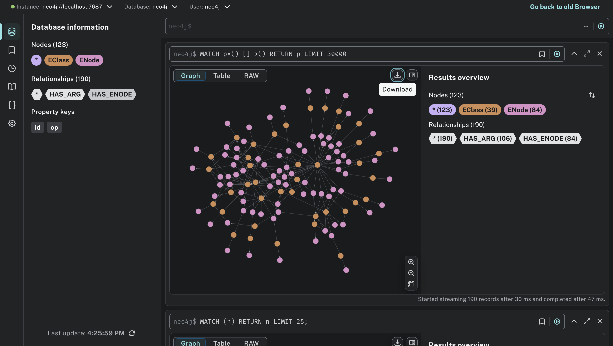

# Neo4j Visualizer for Egraphs

A handy tool for visualizing and exploring egraphs using the Neo4j graph database.

The tool should be easy to use. Prerequisites:
- Make sure Docker is installed
- Have your egraph written to a JSON file using the `egraph_serialize` package

Then, start up a Neo4j instance, run this tool on your egraph, and view the results in your browser. Here's a fully working example if you simply want to copy and paste:

```sh
# Clone this repo.
git clone https://github.com/gussmith23/egraph-serialize-neo4j
cd egraph-serialize-neo4j

# Start Neo4j server in the background.
NEO4J_URI=bolt://localhost:7687
NEO4J_USERNAME=neo4j
NEO4J_PASSWORD=neo4j-password
docker run \
    -d \
    --publish=7474:7474 --publish=7687:7687 \
    --env NEO4J_AUTH=neo4j/neo4j-password \
    neo4j

# Run the tool on a serialized egraph to insert it into Neo4j.
# Replace --json path with your egraph.
cargo run -- \
  --json tests/data/churchroad_simple_mul_1_stage.json \
  --uri $NEO4J_URI \
  --username $NEO4J_USERNAME \
  --password $NEO4J_PASSWORD
```

Now open your browser to <http://localhost:7474>, login with the username and password provided above, and view your egraph:



One helpful Cypher command is

```cypher
MATCH p=()-[]->() RETURN p LIMIT 1000
```

which will show all nodes and connections (subject to the limit, which you can increase).

Note: this tool does not clear the graph database before inserting the egraph. If you would like to ensure the database is empty, clear it with:
```cypher
MATCH (n) DETACH DELETE n
```